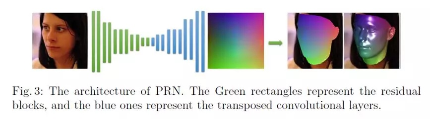

# 3DfaceReconstruction
some resources about 3D face reconstruction

## 3D 人脸数据
3D 人脸相关任务一般有 3 种表征数据的方式：点云，网格图和深度图。

点云（Point cloud）
在三维点云中，每一个点都对应一个三维坐标 {x,y,z} 。许多三维扫描设备使用这种数据格式存储采集到的三维人脸信息。有时，人脸的纹理属性也可以拼接到形状信息上，这时点的表达就成了 {x,y,z,p,q} ，其中 p，q 是稀疏坐标。

点云表示的缺点是每一个点的邻域信息不好获取，因为点的存储一般是无序的。一般情况下，点云数据会用来拟合一个平滑的曲面，以减少噪声的影响。

网格（Mesh）
三维网格使用在三维曲面上预计算好并索引的信息进行表示，相比于点云数据，它需要更多的内存和存储空间，但是由于三维网格的灵活性，更适合用来做一些三维变换，例如仿射变换、旋转和缩放。每一个三维网格数据，由以下元素构成：点、线、三角面。二维纹理的坐标信息也可以存储在点信息中，有利于重建更精确的三维模型。

深度（Depth/Range）
深度图像也称之为 2.5D 或者 Range 图像。三维人脸的 z 轴数值被投影至二维平面，效果类似一个平滑的三维曲面。由于这是一种二维表示方式，所以很多现存的二维图像的处理方法可以直接应用。这种数据可以直接以灰度图的方式展示出来，也可以使用三角剖分原则转换成三维网格。

做 3D 人脸首先必不可少的就是 3D 数据，然而现状却是公开数据少，远少于 2D 人脸图片，3D 高精度人脸只能靠昂贵的设备采集，过程繁琐，本文梳理了现有公开常用的 3D 或 2.5D 人脸数据集，关于数据库和 3D 人脸任务的介绍推荐参考《三维人脸研究》（链接：http://blog.csdn.net/alec1987/article/details/7469501）。

## 常用Pipeline

2D 人脸相关任务的 Pipeline 一般分为数据预处理、特征提取、特征分析等过程，那么 3D 人脸的 Pipeline 呢？这里本文引用《3D Face Analysis: Advances and Perspectives》（链接：<https://link.springer.com/chapter/10.1007/978-3-319-12484-1_1>）中的图片进行讲解。

一个通用的 3D/2.5D 人脸分析框架如上图所示。我们通过设备获取人脸的 3D/2.5D 表示（Mesh、Point Cloud、Depth），经过一些预处理操作如球形剪裁，噪点去除，深度缺失修复，点云配准等进一步获取可用的 3D/2.5D 人脸。接下来对预处理后的人脸进行表征，表征的方式有很多，比如采用表面法向，曲率，UV-Map 或常用的 CNN 方法；在提取一个特征之后就可以进行各种人脸任务，比如识别、表情分析、性别分类、年龄分类等。鉴于本文的目的是梳理 3D 人脸入门相关知识，这里先为大家简单介绍一下关于 3D 人脸重建和识别的相关工作，包括发展过程和一些比较容易上手的论文。

## 3D人脸重建
3D 人脸研究中另一个比较受关注的方向是 3D 人脸重建，即通过一张或多张 RGB 的人脸图像重建出人脸的 3D 模型，它的应用场景很多，比如 Face Animation，dense Face Alignment，Face Attribute Manipulation 等。其实 RGB 到 3D 的人脸重建是一个病态问题，因为 RGB 图像其实表征的是纹理特征而并没有空间信息，但考虑到实际的应用价值，这些年也陆续提出一些 3D 重建方法。本文将介绍几种比较流行的人脸 3D 重建方法，供入门的小伙伴们参考，更多关于 3D 人脸重建总结推荐参考《3D人脸重建总结》(<https://blog.csdn.net/u011681952/article/details/82623328>)，这里先给出一个 3D 人脸重建的实例（取自PRNet）。

### 基于传统方法的人脸重建
传统 3D 人脸重建方法一般通过图像本身表达的信息完成 3D 人脸重建，如图像的视差、相对高度等，比较常见的如通过双目视觉实现 3D 重建，难点在于如何匹配不同视角下对应的特征点,关于这类文章大家可参考《A Survey of Different 3D Face Reconstruction Methods》。

### 基于模型的人脸重建
3D 人脸重建中有两个比较常用的模型，其中一个为通用模型 CANDIDE，另一个为 3DMM。众多通用模型中，CANDIDE-3 可谓名气最大，由 113 个顶点和 168 个面组成。简单来讲，通过修改这些顶点和面，使得其特征与待重建的图像相匹配。通过整体调整，使五官等面部关键点尽量对齐；通过局部性调整，使人脸的局部细节更加精细，在这之后进行顶点插值，即可以获得重建后的人脸。该模型的优缺点显而易见，模板的顶点数量过少，重建速度快，但重建的精度严重不足，面部细节特征重建欠佳。

入门 3D 人脸一定会接触的算法是 3D Morphable Model (3DMM)，这是 1999 年由 Volker Blanz 在《A Morphable Model For The Synthesis Of 3D Faces》一文中提出的一种人脸模型的线性表示，可以将一张 2D 的人脸图片生成其对应的 3D 人脸模型，表示方法为：

其中 si 和 ei 分别为通过统计分析 PCA 得到的 shape 和 expression 基，使用 3DMM 模型重建人脸首先需要这两组基，目前使用较多的是 BFM 基【下载地址】,【论文地址】。那么如何从二维重建三维呢？首先要了解三维模型是如何投影到二维平面的，上文最开始讲的相机模型，把三维模型投影到二维平面可以表示为：

利用一个人脸数据库构造一个平均人脸形变模型，在给出新的人脸图像后，将人脸图像与模型进行匹配结合，修改模型相应的参数，将模型进行形变，直到模型与人脸图像的差异减到最小，这时对纹理进行优化调整，即可完成人脸建模。一般 2D 到 3D 重建过程所采用的监督方式为 2D 人脸关键点与 3D 顶点对应的正交投影上的关键点。

### 基于 CNN 端到端的人脸重建
有了 3DMM 模型，即可进行单张 2D 人脸的 3D 重构，但一个现实问题是，传统 3DMM 重建是迭代拟合的过程，该过程效率比较低，因此并不适用于实时的三维人脸重建。分析 3DMM 原理可知，需要调整的就是 3DMM 的 199 维参数（这个不同的基不一样哦），为什么不用CNN 回归基的参数呢？这样我们可以通过网络去预测参数，实现 3DMM 的快速重建。但是有一个问题，我们如何获得训练数据？为此，大多数论文选择利用 3DMM 线下拟合大量人脸图片作为 ground-truth，然后送入神经网络去训练。虽然是个病态问题，但效果还不错。本文将介绍几篇通俗易懂的基于 CNN 端到端的 3D 人脸重建方法。
<Disentangling Features in 3D Face Shapes for Joint Face Reconstruction and Recognition>
该论文通过 CNN 回归 Identity Shape 和 Residual Shape 参数，表达式和 3DMM 类似，不同之处在于除了普通的 reconstruction loss（一般为 element-wise L2 loss），还增加了一个 Identification loss，以保证重建的人脸 ID 特征不变。

<End-to-end 3D face reconstruction with deep neural networks>
该论文的思想也是回归 3DMM 参数，作者认为高层的语义特征可以表示 ID 信息，而中间层的特征可以表示表情特征，因此可从不同的层级回归相应的参数，从而实现 3D 人脸重建任务。

<Joint 3D Face Reconstruction and Dense Alignment with Position Map Regression Network>
另一种比较常见的端到端 3D 人脸重建方法为 Position Regression Network（PRN），强推！（附开源代码 PRN）。该论文提出一种端到端 Position Regression Network，以完成 3D 人脸重建和稠密人脸对齐。作者引入 UV Position Map，可以实现通过 2D 图像来存储人脸 3D 点云坐标，假设一个包含 65536 个点的 3D 点云，通过 UV Position Map 可以表示成一个 256*2563 的 2D 图像，每一个像素点存储的是点云的空间坐标，因此可以通过一个 encoder-decoder 网络回归原始图像的 UV Position Map，实现 3D 人脸重建。作者通过设计一个不同区域不同权重的 Loss Function，最终实现了较高精度的人脸重建和稠密关键点对齐。

<3D Dense Face Alignment via Graph Convolution Networks>
通过上述回归 UV Position Map 的方式有一个问题，最终 UV 图像映射到 3D 人脸 mesh 的图像时，会出现一些条纹。在最近的一些 3D 人脸重建工作中，还有一种通过多级回归 3D 人脸 mesh 的方法取得了不错的重建效果。该论文作者通过逐级增加回归的 mesh 顶点，从而在多个监督的任务下完成最终 mesh 的回归，同时采用图卷积的形式可以更加本质地进行点与点之间的构图关系，最终取得了不错的重建效果。

3D 人脸重建是近年的一个热门话题，每年各种会议也有许许多多的文章提出各种各样的 3D 人脸重建方案，但从入门角度考虑，掌握上述几种常见方法会对之后的研究会打下不错的基础。

